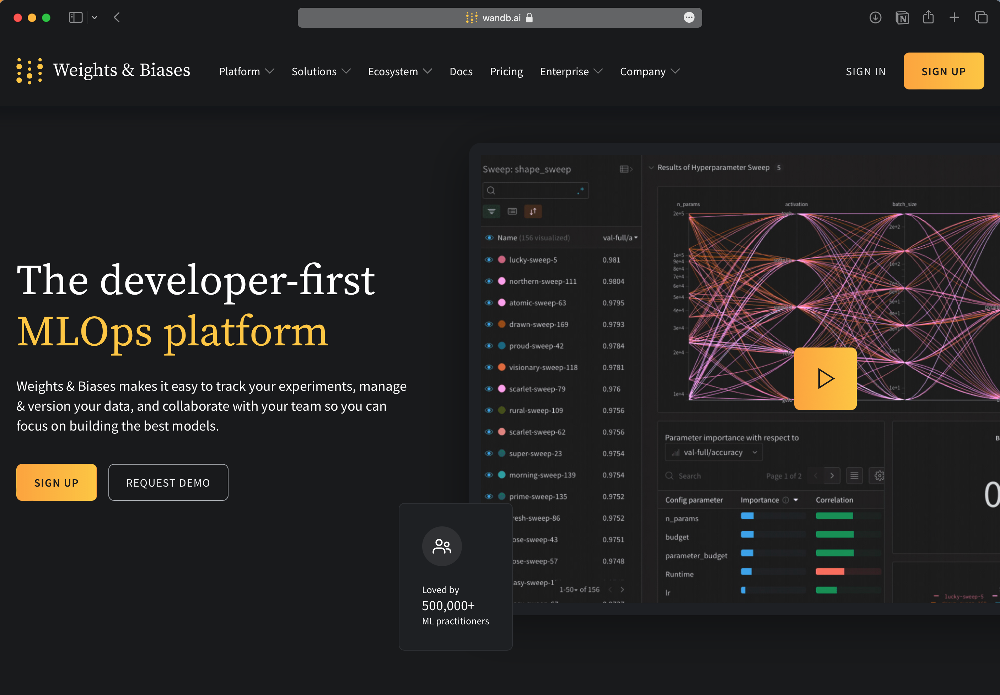
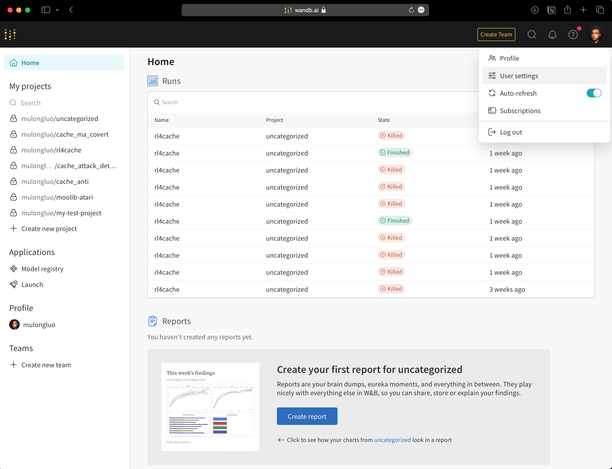
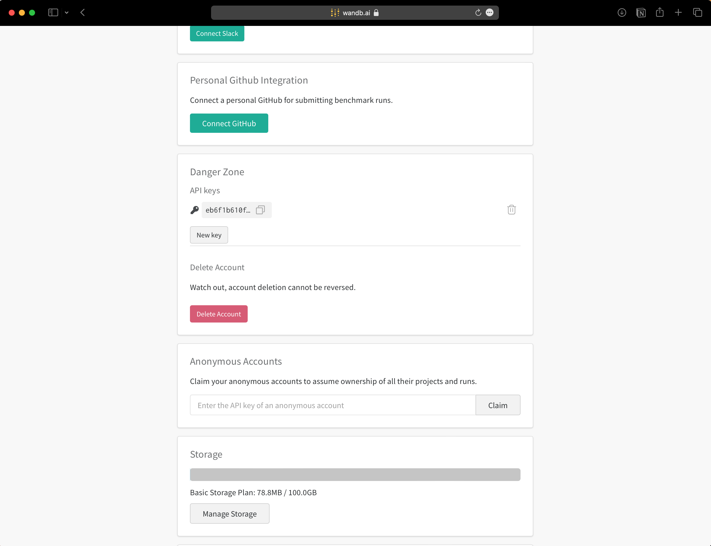
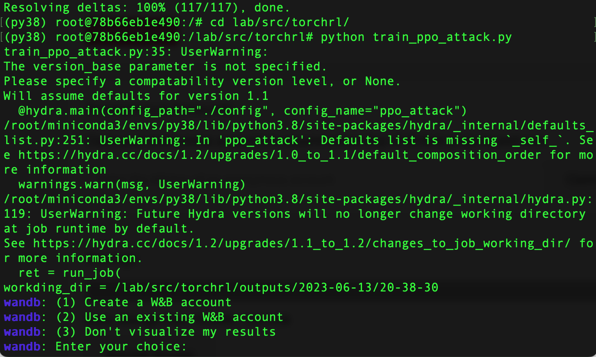
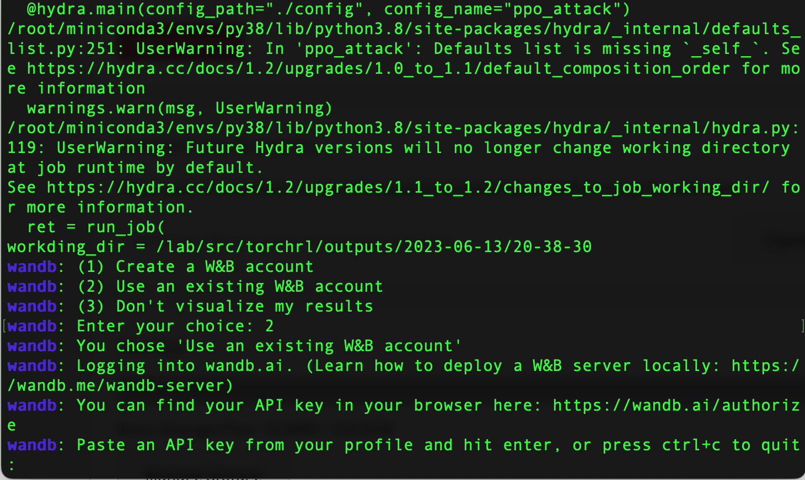
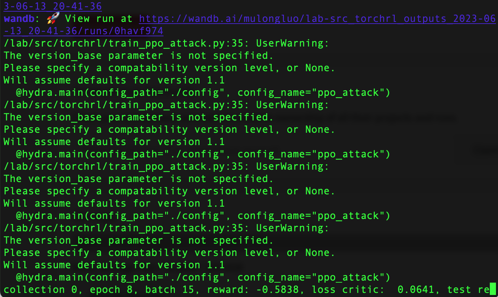
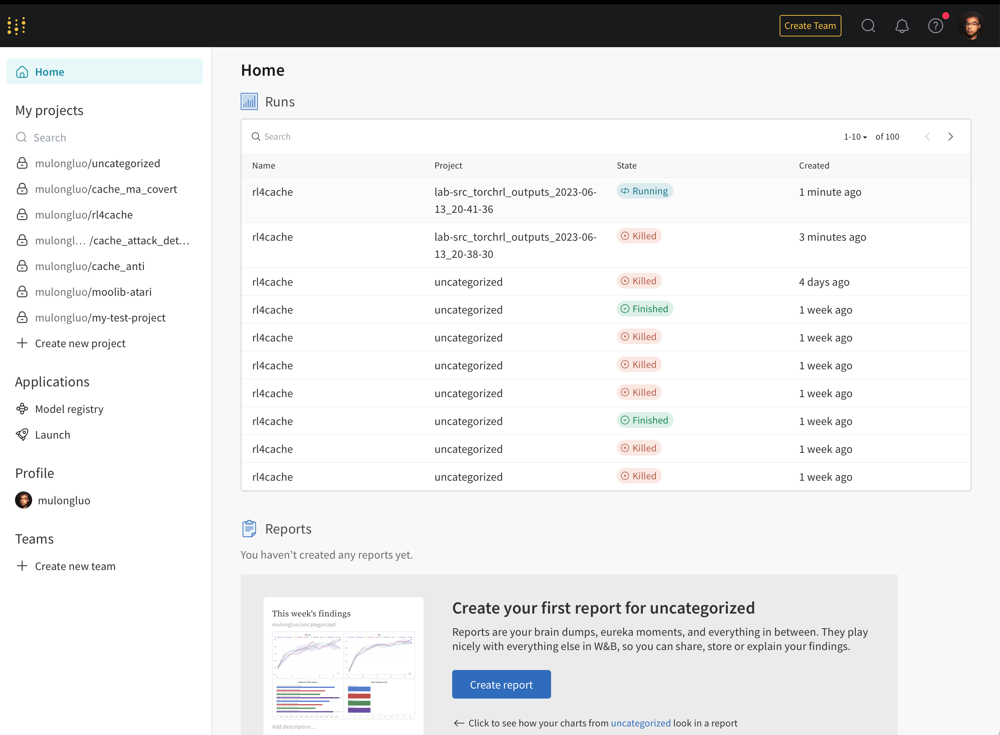
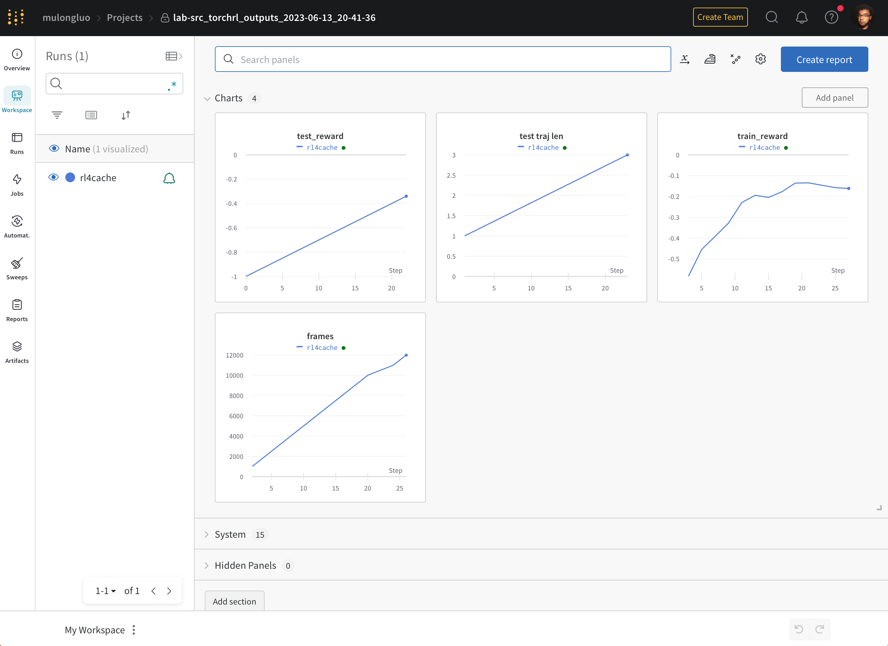

### Introduction

The lab uses torchRL and open AI gym. The training can be performed on CPU/GPU, however, it is best that the experiments is running on GPU. 
In order to streamline the setup process and focus on the environment construction and training we have AWS ```g5.xlarge``` instances for use and 
provide docker images to manage all the dependencies. 

### Access the AWS g5.xlarge instance

To access the ```g5.xlarge``` instance, please use the following google form

[```https://forms.gle/HgXwz4VSSpN7K6Um6```](https://forms.gle/HgXwz4VSSpN7K6Um6)

Once you submit your email, the login method and credentials will be emailed.

### Launch the docker image

Once you log on the AWS instance, please use the following command to pull the docker image 

```
$ docker pull ml2558/autocat-torchrl:new
```

Once it is finished, please use the following command to launch the docker image

```
$ docker run -it --gpus all ml2558/autocat-torchrl:new /bin/bash 
```

After that you will be prompt to a docker shell.

### Activate the conda environment

inside the docker container, set the conda environment variables and activate the py38 environment

```
# eval "$(/root/miniconda3/bin/conda shell.bash hook)" 
# conda activate py38
```

### Create an ```wandb``` account for visualizing the training progress.

```wandb``` is a popular tool for visiualizing machine learning-related data. If you are already have an account you can skip the signup process and get your API key associated with your ```wandb``` account.

Other wise please sign up here [```https://wandb.ai```](https://wandb.ai), or follow the instruction here [```https://docs.wandb.ai/quickstart```](https://docs.wandb.ai/quickstart).

Below we show the Wandb webpage, click on the top right to sign up or sign in.



After sign up and log in, click on the top left and find "User Settings".




Inside the profile setting, scroll down and find danger zone, copy the API key and pasted to a note where you can later retrive.




### Clone the code and start the training

Once you have set up the ```wandb``` account, you can clone the code inside the docker shell

```
# git clone https://github.com/rl4cas/lab
```

You can test the code here.

```
# cd lab/src/torchrl
# python train_ppo_attack.py
```
Select (2) when prompted and paste your ```wandb``` API keys.




Then Paste your wandb API keys here.




Your RL training job should be start running.




After that you can open your browser and go to wandb.ai. Select the running job in the list.

 


Here the training progress is shown in wandb for this job you just launched.




Which shows the test_reward, test_trajectory length, train_reward, and frames.


